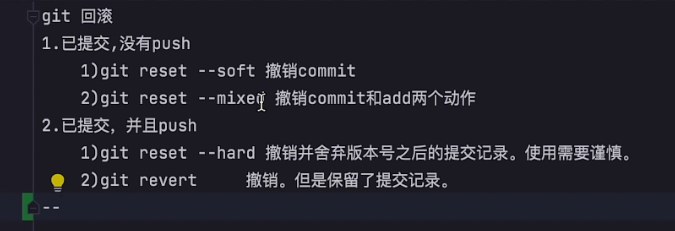
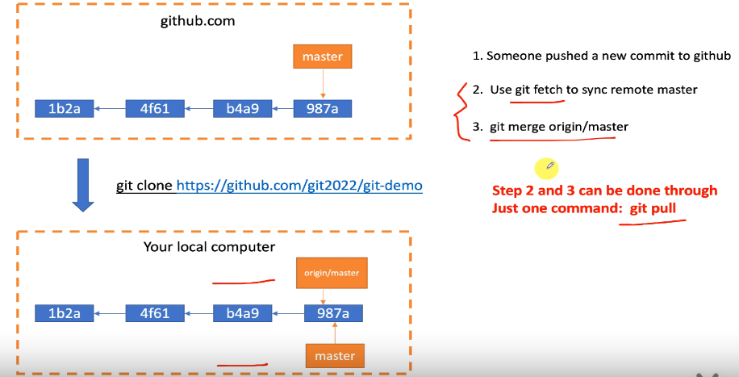

# git学习开始了

#### git回滚操作

> + 所以说***git revert 是取消某个步骤***
> + ***git reset ***是舍弃步骤后的记录
>   + ***git reset --mixed***   被挡住了，怕你不知道，说一下

#### 远程更新到本地

#### 合并和解决冲突

+ git merge合并
+ 解决冲突就直接改代码就是了
+ 但是删除文件注意 rm 和 git rm的区别

#### 常用命令

+ ***git remote -v          显示远程仓库origin***
+ ***git config --system / global / local   push.defualt ''***
  + ***local>global>system ,平时我们使用pull/push的简写就是用的这个***
  + *git2.0之前的版本，push.default = matching，git push后则会推送当前分支代码到远程分支，而2.0之后，push.default = simple，*
+ ***git branch --unset-upstream   |    git branch -u origin/branch***
  + *设置upstream和删除upstream*
  + 注意push时候设置时origin 'branch'; git branch 的时候设置origin/branch   
+ ***git log --oneline***
+ ***git branch      git branch -a     git branch -r***
+ ***！！！***git是以文件为追踪对象，空文件不会被追踪
  + ***git ls-tree***        和        ***git ls-files***
+ git diff
+ git checkout .
  + 放弃所有工作区域的修改
  + git reset --mixed        git reset --soft
    + 分别撤销add和commit    只撤销add

前端的跨端技术： 	reactNative    weex	  flutter	  electron     kraken

#### git pull 的使用

1. git remote show origin 

> 可以详细的看到远程的一些信息

2. git fetch -v ：查看所有的分支（本地和远程）是否同步

#### 修改分支 & 删除分支

##### 1. 修改分支

> + 本地： ***git branch -m oldName newName***
> + 远程：
>   1. 删除远程
>   2. 重命名本地分支
>   3. git push到远程
> + tip:   vscode中遇到冲突使用add，默认保留theirs

2. ##### 删除分支

   > + 本地： ***git branch -D <name>***
   > + 远程:   ***git push --delete origin <name>***

wrap   margin  

